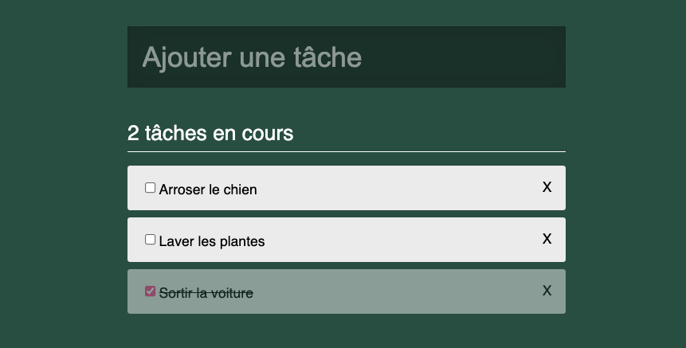

# Todolist en déclaratif

Créons une todolist en programmation déclarative avec JavaScript 😃 


## Préparer les données du state

Créons un objet dans lequel on places les données qui vont piloter notre rendu, ici les taches. Appelons cet objet le `state`.

Voici une liste de taches à stocker dans le state : 
```js
[
  {
    label: 'Arroser le chien',
    done: false
  },
  {
    label: 'Sortir la voiture',
    done: true
  },
  {
    label: 'Laver les plantes',
    done: false
  }
],
```

## Coder le rendu en fonction des données du state

Créons une fonction `render` qui va : 
- vider le potentiel affichage existant dans le div app
- puis tout dessiner : le compteur et la liste

Pour dessiner le compteur et la liste, on se base sur les données du state et on utilise la fonction `configureElement` qu'on a vu ensemble aujourd'hui.

## Modifier les données du state suite à une interaction

### Au click sur un li modifier le `done` de la tache

Ajoutons un écouteur d'evenement `click` sur les li et dans le handler on va inverser la valeur de la propriété `done` de la tache correspondante dans le state, puis on va refaire le rendu (en executant la fonction render).

## BONUS : ajouter une nouvelle tache

Dans la fonction `render` ajoutons la création d'un élément `form` contenant un element `input`.
Ajoutons un écouteur d'evenement `submit` sur le formulaire et dans le handler, ajoutons une tache au tableau des taches dans le state, puis on va refaire le rendu (en executant la fonction render).